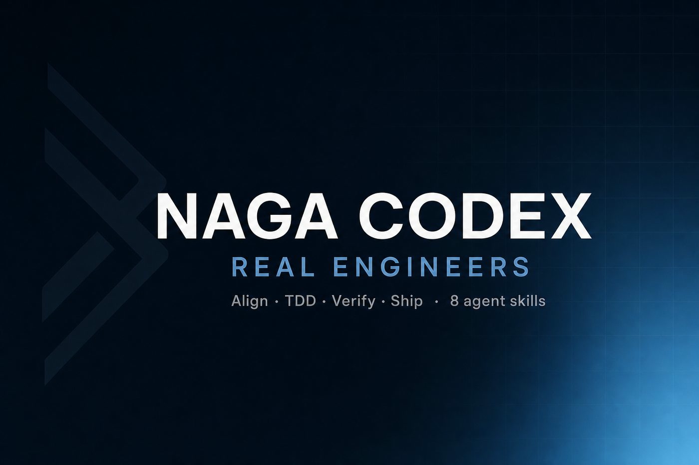

# Naga Codex — Real Engineers

**Repo:** [`Nagacash/-Real-Engineers`](https://github.com/Nagacash/-Real-Engineers)  
_Pack name: Naga Codex Agent Engineering (Tier A)_


**Tier A+** — small, original agent skills for real engineering discipline.  
Align · Context · TDD · Dual-axis review · Ship  

[](LICENSE)
[-0B3D5C.svg)](docs/why-tier-a.md)
[](examples/README.md)

<p align="center">
  
</p>


> Not vibe coding. Not a process cult. Composable skills you control.

## Skills (8)

| Skill | Invoke when |
|-------|-------------|
| [`ask-naga`](skills/ask-naga/) | Unsure which skill fits |
| [`naga-align`](skills/naga-align/) | Requirements fuzzy — grill before build |
| [`naga-context`](skills/naga-context/) | Need shared language / CONTEXT.md |
| [`naga-tdd`](skills/naga-tdd/) | Red → green → refactor one slice |
| [`naga-review`](skills/naga-review/) | PR/diff: Standards ∥ Spec |
| [`naga-ship`](skills/naga-ship/) | Orchestrate idea → done |
| [`naga-verify`](skills/naga-verify/) | L1/L2/L3 quality gate after generation |
| [`naga-debug`](skills/naga-debug/) | Hypothesis-driven bug/perf diagnosis |

## Install

```bash
git clone https://github.com/Nagacash/-Real-Engineers.git
cd -- -Real-Engineers

./install.sh claude           # ~/.claude/skills
./install.sh project-claude   # ./.claude/skills
./install.sh agents           # ./.agents/skills

# Hermes (namespaced — no foreign-pack pollution)
export SKILLS_DIR=/opt/data/skills
./install.sh hermes
./scripts/verify-install.sh "$SKILLS_DIR/naga-codex-eng"
```

## Pair with Cyber

Security audits stay in **[NagaCodex-cyber-security](https://github.com/Nagacash/NagaCodex-cyber-security)**  
(`naga-codex/` on Hermes). This pack is `naga-codex-eng/`.

Typical combo: `naga-align` on engagement scope → cyber `full-security-audit`.

## Inspiration (not a fork)

Failure-mode framing is common in modern agent-engineering practice (including
ideas discussed around mattpocock/skills and quality-gate patterns from the vibe-coding-playbook tradition, MIT where applicable). **All skill text here is original
Naga Codex.** See [NOTICE](NOTICE).


## Visual assets

| File | Use |
|------|-----|
| [`assets/hero-banner-photo.svg`](assets/hero-banner-photo.svg) | README hero |
| [`assets/og-card-photo.svg`](assets/og-card-photo.svg) | Social / Open Graph (export JPG for GitHub Settings → Social preview) |
| [`assets/hero-banner.svg`](assets/hero-banner.svg) · [`og-card.svg`](assets/og-card.svg) | Lightweight vector fallbacks |

**GitHub Social preview:** Settings → General → Social preview → upload a PNG/JPG export of `og-card-photo.svg`.

---
## Naga Codex

nagacodex.cloud · AI management · Cybersecurity · Film
